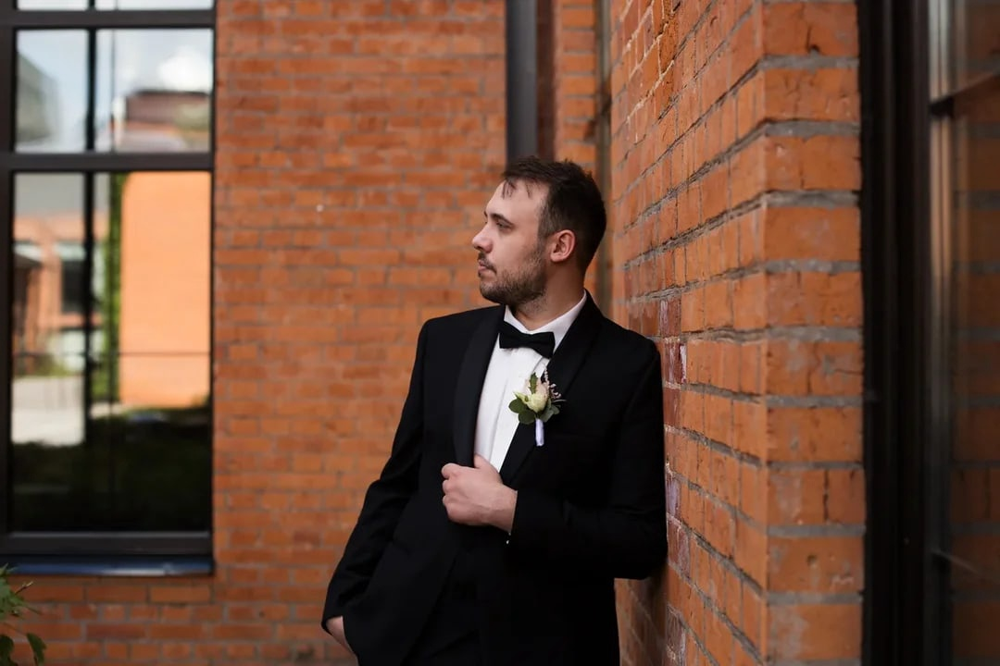

# Щелоков Александр Сергеевич
Мужчина, 29 лет, родился 31 января 1995

Проживает: Санкт-Петербург, м. Комендантский проспект
Гражданство: Россия, есть разрешение на работу: Россия

## Желаемая должность 
Тестировщик ПО
Специализации:  
— Тестировщик
Занятость: полная занятость
График работы: удаленная работа
Желательное время в пути до работы: не более часа

## Опыт работы —5 лет 4 месяца
### ООО Строй Вектор 
Май 2021 — Август 2023
2 года 4 месяца	
Старший менеджер по продажам
Продажи основного продукта и аксессуаров, консультирование клиентов, заключение договоров, 
контроль оплаты, управление командой из 2-ух человек в доп. офисе.

### ООО Регион-Навигация
Сентябрь 2017 — Август 2020
3 года	
Менеджер по продажам
Активные продажи, переговоры, полное ведение сделки, работа с документами. 

## Образование
Высшее
### 2021	Санкт-Петербургский государственный университет промышленных технологий и дизайна, Санкт-Петербург
Бизнес коммуникаций, Менеджмент - малый бизнес
### 2015	МТК
Ремонт автомобилей и автомобильного транспорта, Слесарь 2-ого разряда

## Ключевые навыки
### Знание языков	
Русский — Родной
Английский — B1 — Средний
### Навыки
Пользователь ПК, Английский язык, Уверенный пользователь ПК, Работа с большим объемом информации, Коммуникабельность, Ответственность Проведение тестирований, Ручное тестирование, Postman, Тестирование пользовательского интерфейса, Функциональное тестирование, Нагрузочное тестирование, Git, GitHub, Тест-дизайн и проектирование тест-кейсов, Основы Java

## Опыт вождения
Имеется собственный автомобиль
Права категории B

## Обо мне
1. Пользователь ПК (Microsoft word, Power Point, Exel, Snagit, CorelDRAW, IntelliJ IDEA, JMeter, Postman) 
2. Иностранные языки: английский Pre-intermediate 
3. Личные качества: ответственность, внимательность, коммуникабельность.
4. Увлечения: хоккей, видеоигры, кино, музыка

## Мои соц. сети
[VK](https://vk.com/molodzelen)
[Telegram](https://t.me/alexmnms)
